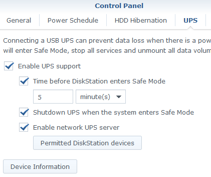
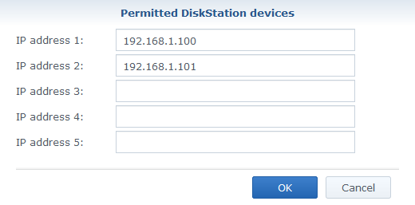
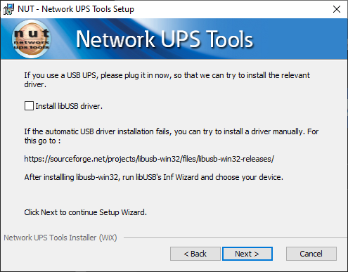

<!-- Abbreviations -->
*[DSM]: DiskStation Manager
*[NAS]: Network-attached storage
*[NUT]: Network UPS Tools
*[SSH]: Secure Shell
*[UPS]: Uninterruptible Power Supply
*[USB]: Universal Serial Bus

# UPS

## Resources

* [Source: Reddit](https://old.reddit.com/r/synology/comments/gtkjam/use_synology_nas_as_ups_server_to_safely_power/)
* [Source Archive](https://web.archive.org/web/20200531030925/https://old.reddit.com/r/synology/comments/gtkjam/use_synology_nas_as_ups_server_to_safely_power/)
* [Network UPS Tools](https://networkupstools.org/)

## Instructions

### Why?

Most consumer UPS' only have a single USB port to control a single device in the event
of a power outage and the battery running low. These instructions are to allow your
Synology NAS to shutdown other critical devices with it when the power goes out.

### Synology (Server)

1. Connect NAS to UPS via USB cable
2. Open up DSM and go to Control Panel → Hardware & Power → UPS

3. ??? screenshot "Enable UPS Support and check 'Enable network UPS server'"
        { loading=lazy }

4. ??? screenshot "Click 'Permitted DiskStation Devices' and input the IP addresses of your servers/computers you would like to power down"
        { loading=lazy }

5. Make any other changes to the settings you'd like
6. Apply settings

!!! info "Credentials"
    The credentials can be changed by modifying `/usr/syno/etc/ups/upsd.users` via SSH.

### Linux (Debian)

1. Run `apt install nut`
2. Edit `/etc/nut/nut.conf`
3. Change `MODE=none` to `MODE=netclient`
4. Edit `/etc/nut/upsmon.conf`
5. Add a line somewhere that is `MONITOR ups@192.168.1.150 1 monuser secret slave`
    - Make sure to change the IP address to the IP of your Synology NAS
6. Restart the NUT client service
    - `sudo systemctl restart nut-client.service`
7. Verify connection is successful
    - `sudo systemctl status nut-client.service`

If you are getting any errors, please refer to the Synology section again and make sure
your Linux machine's IP is permitted.

### macOS

For macOS instructions, please
[refer to the GitHub wiki](https://github.com/networkupstools/nut/wiki/NUT-on-Mac-OS-X).

### Windows 10

!!! danger "**SECURITY RISK**"
    This requires the use of very old, likely insecure software and EOL versions of OpenSSL.
    **Continue at your own risk**.

#### Installers/Files

* [Direct Windows MSI installer 2.6.5-6 (networkupstools.org)](http://www.networkupstools.org/package/windows/NUT-Installer-2.6.5-6.msi)
* [Direct Windows MSI installer 2.6.5-6 (GitHub)](https://github.com/networkupstools/nut-package-archive/blob/master/windows/NUT-Installer-2.6.5-6.msi?raw=true)
* [openssl-1.0.2u-i386-win32.zip](https://indy.fulgan.com/SSL/openssl-1.0.2u-i386-win32.zip)

#### Steps

1. Download the latest binary from above.

2. ??? screenshot "Uncheck the box for **Install libUSB driver** during the installation"    
      { loading=lazy }

3. Finish the install
4. Go to your NUT installation folder
    - Default: `C:\Program Files (x86)\NUT\`
5. Go into the `etc` subfolder
    - Path: `C:\Program Files (x86)\NUT\etc`
6. Rename or copy `nut.conf.sample` to `nut.conf`
7. Rename or copy `upsmon.conf.sample` to `upsmon.conf`
8. Open and edit `nut.conf`
9. Change `MODE=none` to `MODE=netclient`
10. Save and close the `nut.conf` file
11. Open and edit `upsmon.conf`
12. Find the `SHUTDOWNCMD` section
    - Default: `SHUTDOWNCMD "/sbin/shutdown -h +0"`
13. Change the default to something like `SHUTDOWNCMD "C:\\WINDOWS\\system32\\shutdown.exe -s -t 0"`
    - Customize the time (`-t 0`) to your liking. Optionally add `-f` to force the shutdown.
    - If you want to hibernate, replace `-s` with `-h`
14. Find the `MONITOR` section
15. Add a line somewhere that is `MONITOR ups@192.168.1.150 1 monuser secret slave`
    - Make sure to change the IP address to the IP of your Synology NAS
16. Save and close the `upsmon.conf` file
17. Copy `libgcc_s_dw2-1.dll` from the `bin` subfolder to the `sbin` subfolder
18. Download [openssl-1.0.2u-i386-win32.zip](https://indy.fulgan.com/SSL/openssl-1.0.2u-i386-win32.zip)
    - The source for this is [indy.fulgan.com](https://indy.fulgan.com/SSL/)
      from [the OpenSSL wiki](https://wiki.openssl.org/index.php/Binaries)
19. Copy `libeay32.dll` and `ssleay32.dll` to the `sbin` subfolder
20. Launch `services.msc` from `Run` (++win+r++)
21. Find the service called `Network UPS Tools` and Start it

#### Monitoring/Verification

You can monitor the service by opening Event Viewer, going to Windows Logs → Application,
and looking for "Network UPS Tools" in the Source column. If everything is working, you
will see "Information" as the Level. If you are getting "Error" refer to the Synology
section again and make sure your Windows machine's IP is permitted.

### Windows 10 (Other)

If the first Windows 10 section does not work for you, you might give
[WinNUT](https://code.google.com/archive/p/winnut/) and
[this guide](https://www.seriouslytrivial.com/2018/09/26/shutdown-windows-computer-and-synology-nas-using-winnut/)
a try.
